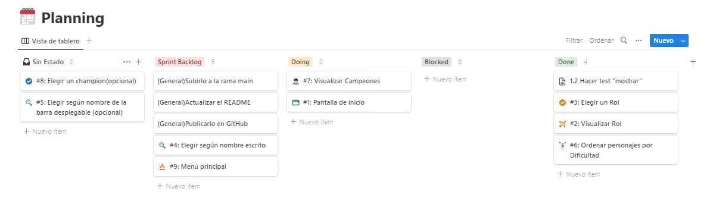
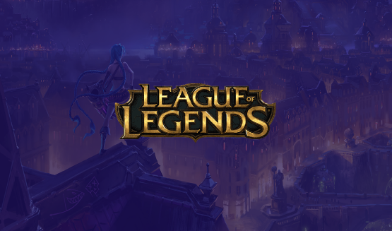

# Data Lovers 🐱‍💻League of Legends

Este proyecto permite al usuario encontrar, obtener e indagar informacion sobre League of Legends, un esports de estrategia multiplayer.

# Investigacion UX
## 1. Planning

El planning contiene una lista de pasos detallada con el MVP (Producto Mínimo Viable) y la planificacion previa del proyecto. 

## 2. Historias de Usuario y Criterios de aceptacion

## 3. UI Diseño de la Interfaz de Usuario 

🔸Prototipo de baja fidelidad 

Los bocetos realizados son en base a la opinion de usuarios para proporcionar la informacion mas util y primoldial respecto al contenido del juego y tomar esto como analisis de partida.

https://www.figma.com/file/pY6lYFKRL5IbeTae58ePR2/League-of-Legends-team-library?type=design&node-id=0-1&t=W2fgLNZGs8YJF5Uv-0

***

🔸Prototipo de alta fidelidad 

Uso de Figma para creacion de diseño como primer prototipo.

https://www.figma.com/file/pY6lYFKRL5IbeTae58ePR2/League-of-Legends-team-library?type=design&node-id=1928-7&t=1eiSMjalcLZXZQPO-0

***

## 4. Pruebas unitarias

Los test son realizados con la libreria Jest para las funciones: "filters", "filterName", "filterRole", "filterDifficulty" para filtrar los personajes segun su nombre, rol y dificultad, la funcion: "sortDifficulty" para ordenar la data y la funcion: "statsDifficulty" para calcular estadisticas.

## 5. Compute Stats

Se visualizan tres barras dinamicas con un set de datos, en ellos se calcula la estadistica en porcentajes de los personajes pertenecientes a los diferentes niveles de dificultad: "low" (baja), "medium" (media) y "high" (alta).

## 6. Responsive Desing

Esta pagina web es receptiva a diferentes tamaños y resoluciones de pantalla como dispositivos moviles y tabletas.

***
Laboratoria DEV008 - Carolyn Yaker & Sandra Caro - 2023
***

